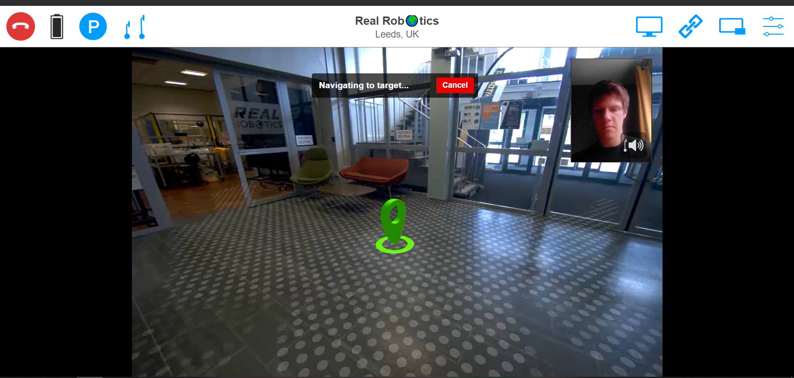
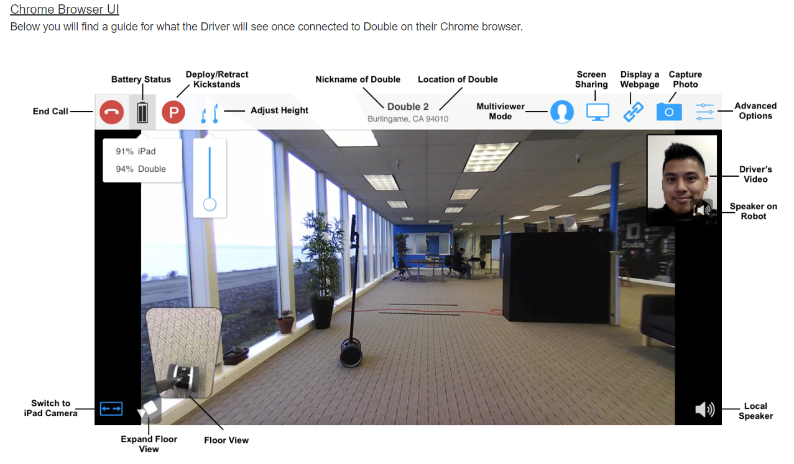
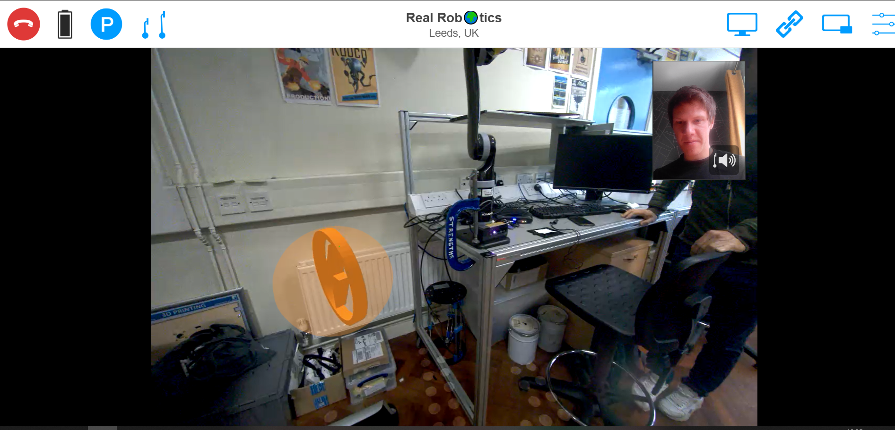

# Double 3 Guide

We now have a Double 3 robot in the lab. This can be called externally for video conferencing and features a mobile base so it can be driven around the lab.

Operation is simple, it has onboard sensors so is difficult to drive into objects and can be easily driven by guests with no prior experience.

For more details about the robot see [https://www.doublerobotics.com/](https://www.doublerobotics.com/) 

## Access

There are two ways to access and drive the robot, one for lab members and one for external visitors.


While the robot is very safe to use you should be aware of the security risks that remote visual access to the lab introduces.

1. Confidential work must not be exposed to unauthorised people
2. Unauthorised access could compromise physical security by showing when the lab is empty.

Not sharing login details and using timed visitor slots will mitigate against these minor risks.


### Member Access

 The robot is linked with a single account, this can be logged into remotely via a web browser and used to drive the robot. 


To Do: Currently, there is no booking system for the robot

Multiple users can log onto the website at the same time but only one can control the robot, it will be greyed out for the others.


Go to [https://drive.doublerobotics.com/](https://drive.doublerobotics.com/) and enter the username and password


If you require access, talk to your supervisor to get these details. 


You can then click on the robot shown on the map - this will initiate a video call. \(You may have to click a pop-up to allow access to your computer's camera and microphone\)

### Visitor Access

Visitor passes can be created with time-limited slots. These can **only** be made using the touch screen on the physical robot, so are for when you are physically in the lab and want others to have remote access for a meeting or tour. These can be made in advance. 

See the instructions here: [https://support.doublerobotics.com/s/article/Sharing-a-Visitor-Pass-on-the-Double-3](https://support.doublerobotics.com/s/article/Sharing-a-Visitor-Pass-on-the-Double-3)

## Driving the robot

Driving the robot is very simple. It is suggested that most users make use of the "click-to-drive" function where you use the mouse to click on a location on the video screen and the robot will autonomously navigate there. 

The arrow keys can also be used for adjusting your position and you have full control over your view including panning the camera, zoom and raising and lowering the head height.

A full list of the keyboard shortcuts is available here [https://support.doublerobotics.com/s/article/Driving-your-Double-3](https://support.doublerobotics.com/s/article/Driving-your-Double-3)

Below is a screen capture of the user interface - this is from the Double 2 so has some minor differences \(The Double 3 has no ipad, no floor view and now has augmented reality overlays\)

The image is from this guide which has more info [https://support.doublerobotics.com/s/article/how-do-i-drive-my-double-using-the-chrome-browser](https://support.doublerobotics.com/s/article/how-do-i-drive-my-double-using-the-chrome-browser)

### Docking the robot.

When you start the robot it will be facing the wall and will reverse a bit to undock itself. You can then use the left and right arrow keys to turn and see the lab. 


Once you have finished using the robot it is highly recommended to drive the robot back to its charging dock to leave it ready for other users. There is no reason to turn the robot off at any time. 


If you want to start the robot in a specific place for a visitor or are only leaving it temporarily you can click the blue P at the top of the screen and the kickstand will deploy, holding the robot stationary. 

To dock the robot drive towards the dock, you will then see an orange lighting bolt symbol floating above it. Click this with your mouse button and the robot will then autonomously dock itself. 

If the symbol is out of shot you can pan the camera down by moving the mouse to the bottom of the video viewer and clicking. 

